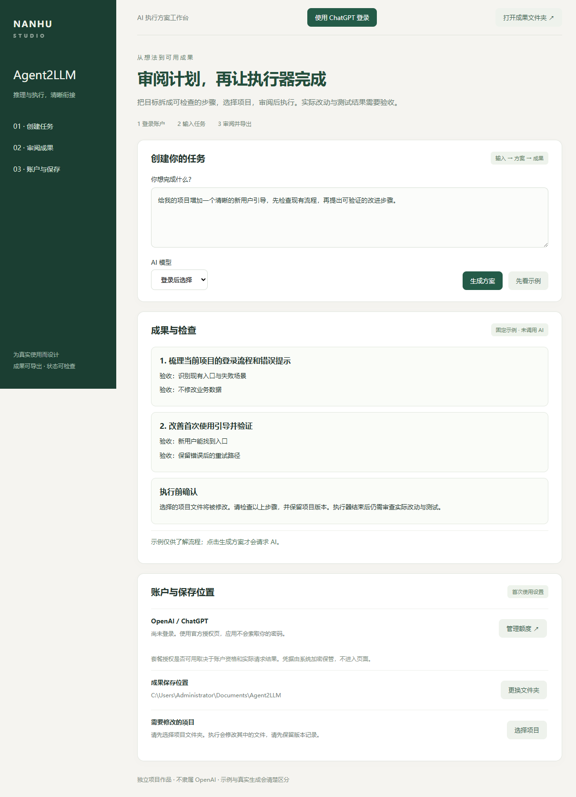

# Agent2LLM · 产品作品集

把复杂目标拆成可审阅的执行步骤，并保留运行证据。

[下载安装包](https://github.com/nanhudev/agent2llm/releases/tag/desktop-v0.4.0) · [三分钟上手](QUICKSTART.md) · [产品案例](PRODUCT_CASE.md) · [简历与面试材料](RESUME.md) · [源代码](https://github.com/nanhudev/agent2llm)

## 用户任务

开发者和解决方案交付人员需要把目标交给执行工具，同时知道它执行了什么、结果能否验收。

## 实际使用流程

选择项目文件夹 → 官方账户授权 → 选择模型 → 输入目标 → 生成步骤 → 审阅步骤 → 确认执行 → 检查项目差异与测试结果。

## 已有证据

桌面窗口和安装后启动已经验证；核心 CLI 263 项测试通过，Windows/macOS/Linux 的 Node 20/22 检查通过。桌面执行器包含原生 Codex，打包检查实际调用其版本命令。

具体测试与实现可在仓库的测试目录、GitHub Actions 及产品案例中审阅。固定配方与固定示例均明确标识，不能当作真实模型请求。

## 当前范围

桌面版集成 Codex 执行器；原有 CLI 保留多适配器能力。固定示例不是实际 AI 执行，真实账户生成与项目修改仍待本人授权验收。运行比较要求目标一致、运行完整且有成功回执和测试证据；未知用量保持未知。

当前桌面版本为 0.4.0 预览版，Windows x64、Mac Apple Silicon 与 Linux x64（AppImage / deb）。安装包未商业签名或 Apple 公证；Mac 已在原生 CI 打包并检查应用窗口，尚未在使用者的 Mac 上手动安装验收。账户资格与额度以官方授权和实际请求为准。

## 产品评价计划

记录首次有效成果的完成时间、失败恢复情况与人工复核原因。引入实际用户后再报告采用率、成本或效率变化；本仓库没有把计划指标写成已经发生的收益。

